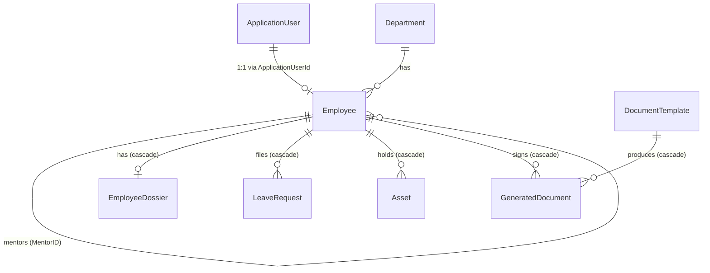
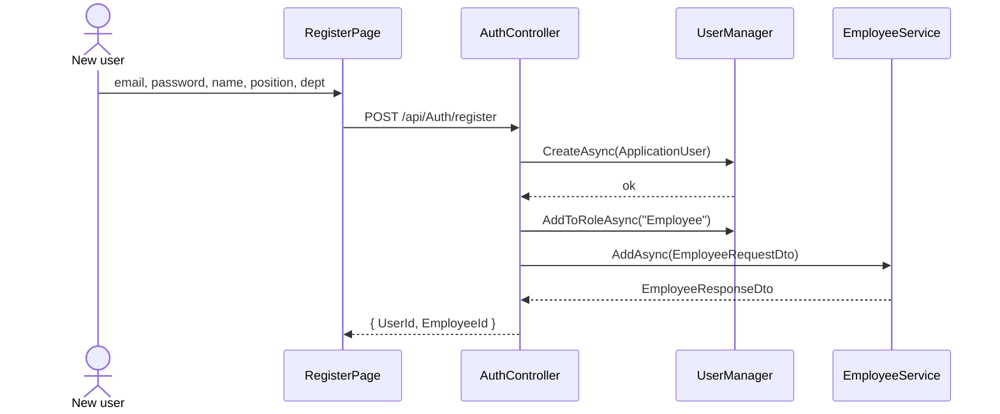
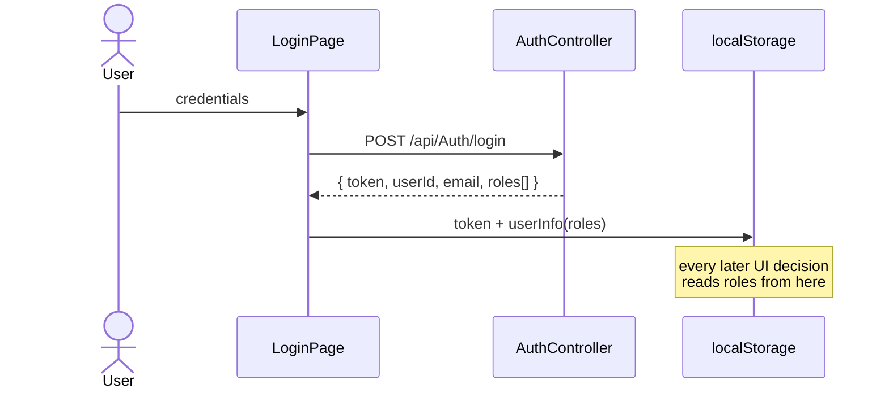
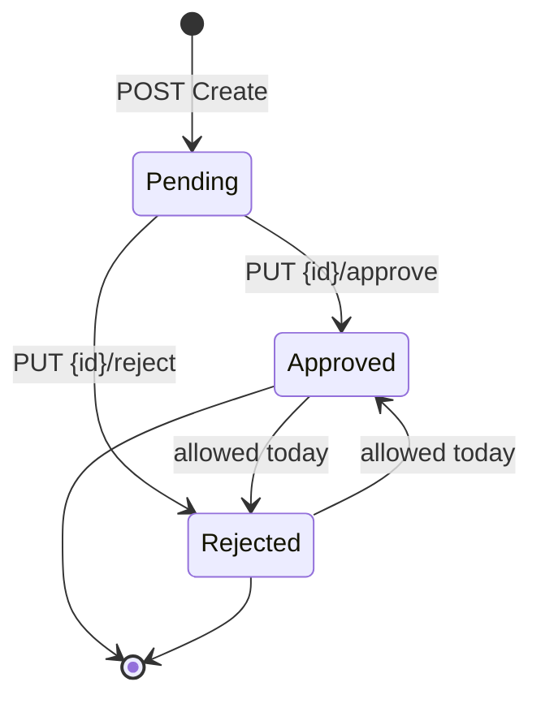
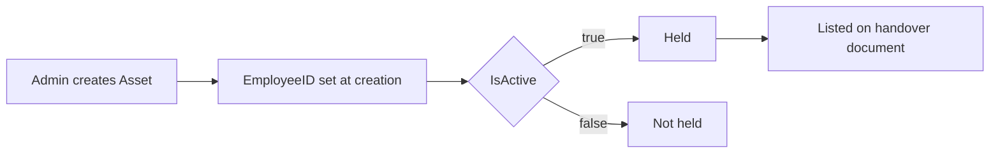
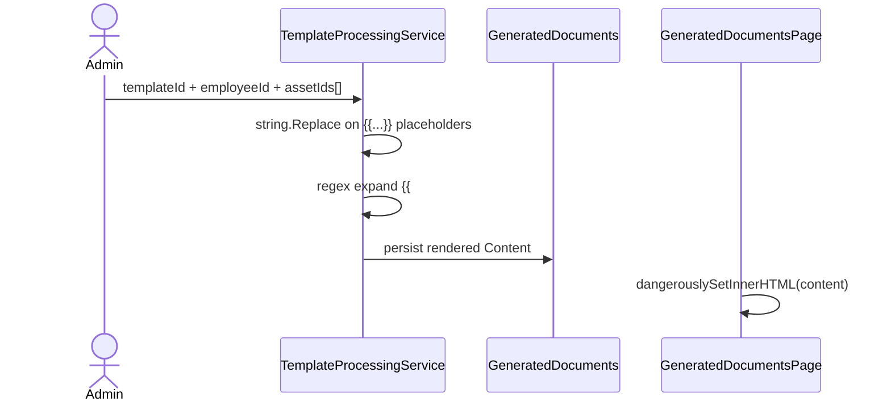

# HR App — Business Process Flow Map

Map of the business processes this system implements, how they move through the
layers, and **where each one is broken today**.

Every "broken" claim below was verified by running the app (backend on `:5190`,
frontend on `:3000`) and calling the API — not by reading code alone. Evidence is
shown inline.

> **Status: this document describes the system as it was audited, before fixes.**
> Sections 4, 5, 7 and 8 have since been addressed — the API now denies by default
> and enforces roles, the five self-service endpoints exist and are token-scoped,
> leave decisions are guarded and attributed, and the template engine validates
> asset ownership, escapes values and no longer corrupts on `$`. The gaps still
> open are leave **entitlement/balance** (§5), asset **custody history** (§6),
> cascade-delete of document history (§2), committed **migrations**, and
> **tests/CI**.
>
> See [`FIXES.md`](FIXES.md) for what changed and the evidence. `CLAUDE.md`
> reflects the current behaviour; this file has not been rewritten.

---

## 1. Actors and roles

| Actor | Role claim | How they get it | What the system intends |
|---|---|---|---|
| HR administrator | `Admin` | Seeded only (`admin@example.com`), never assignable via API | Manage all employees, departments, assets, dossiers, templates; approve leave |
| Employee | `Employee` | Auto-assigned at `POST /api/Auth/register` | See own profile, assets, dossier, documents; request leave |
| Manager / Mentor | *none* | — | Modelled as `Employee.ManagerID` / `MentorID` only; **no behaviour attached** |

The manager/mentor relationship exists in the data model but carries zero
authority — a manager cannot approve their own reports' leave, because approval
is not tied to the org tree at all (see §5).

---

## 2. Domain model



**Cascade risk:** deleting one `Employee` cascades to their dossier, every leave
request, every asset record, **and every generated document**. There is no soft
delete and no archival, so an offboarding wipes the signed-document history it
exists to preserve.

**Orphan:** a legacy `Users` table still exists in the database and
`Models/User.cs` still compiles, but `DbSet<User>` was removed from the context.
`UserController` → `IUserService` is unregistered in `Program.cs`, so every
`/api/User/*` call fails at DI resolution.

---

## 3. Flow — Registration & onboarding



Anyone who can reach the API can self-register and receive a real `Employee`
record. There is no invite, no approval step, and no admin review — self-service
signup is treated as hiring.

**Not transactional.** The Identity user and the `Employee` row are written in
two independent operations. If `AddAsync` throws (e.g. the unique index on
`Employee.Email` rejects a duplicate), the user account survives with no linked
employee — a login that works but resolves to nothing.

---

## 4. Flow — Authentication & authorization



**This is the system's central defect.** Authorization is enforced *only* in the
browser. `isAdmin()` reads `roles` out of `localStorage`; the API almost never
checks.

Verified against the running API with **no token at all**:

```
GET /api/Employee/GetAll           200
GET /api/Asset/GetAll              200
GET /api/LeaveRequest/GetAll       200
GET /api/EmployeeDossier/GetAll    200   <-- birth dates, home addresses, emergency contacts
GET /api/GeneratedDocument/GetAll  200
GET /api/DocumentTemplate/GetAll   200
GET /api/Department/GetAll         401   <-- the only guarded action in the codebase
DELETE /api/Employee/Delete/{id}   204   <-- unauthenticated destructive write accepted
```

`[Authorize]` appears exactly once in the whole solution: on
`DepartmentController.GetAll`. Not on the class — on that single method, so
`Department` `Create`/`Edit`/`Delete` are open too.

Two distinct consequences:

1. **Anonymous access.** Anything that can reach port 5190 reads the full HR
   dataset including PII, and can delete records.
2. **Privilege escalation.** Even if anonymous access were closed, a logged-in
   `Employee` can set `userInfo.roles = ["Admin"]` in localStorage and the
   admin UI unlocks — with an API that would not object.

`Program.cs` has no `FallbackPolicy`, so "no attribute" silently means "public".

---

## 5. Flow — Leave request lifecycle



What `LeaveRequestService` validates: `EndDate > StartDate`, and the employee
exists. That is all.

Missing, in rough order of business impact:

| Gap | Effect |
|---|---|
| No entitlement / balance model | Nothing tracks how much leave anyone has. An employee can book 300 days. |
| No approver identity recorded | `Approved` is a bare string. No who, no when, no reason. Unauditable. |
| No state guard | `Approved → Rejected` and re-approval are both accepted. The transitions above are enforced nowhere. |
| No overlap check | The same dates can be requested and approved repeatedly. |
| Approval not tied to org tree | Any caller approves anyone's leave; `ManagerID` is ignored. |
| `LeaveType` is a free string | `'Vacation'`/`'Sick'` is a comment on the model, not a constraint. |
| No notification | A request sits until someone happens to look at the dashboard. |

The route shape is also awkward: `[Route("api/[controller]/[action]")]` plus
`[HttpPut("{id}/approve")]` composes to
`PUT /api/LeaveRequest/Approve/{id}/approve`, which is what the frontend calls.

---

## 6. Flow — Asset lifecycle



Assets are assigned by writing `EmployeeID` at creation. There is no transfer
operation, no return date, and no custody history — reassignment overwrites the
holder and the previous assignment is gone. `IsActive` is the entire lifecycle.

`AssetService.CreateAsync` does not verify the employee exists and does not
pre-check the unique `SerialNumber` index, so a duplicate serial surfaces as a
`DbUpdateException` → HTTP 500 rather than a 400 with a usable message.

---

## 7. Flow — Document template & generation



This is the most business-critical logic in the app — it produces the documents
people sign — and it is the least robust. Four defects, all reproduced live
through `POST /api/DocumentTemplate/Preview`:

**a. Assets are never checked against the employee.** Rendering employee
`markOO tasevski`'s handover with two *other* employees' asset IDs:

```
EMPLOYEE: markOO tasevski
A: Laptop / SN123456789        <-- Bob Smith's
A: Office Chair / SN564738291  <-- David Wilson's
```

**b. A second `{{#assetList}}` block renders using the first block's template.**
`Regex.Match` finds only block A, then `Regex.Replace` substitutes *every*
occurrence with block A's output:

```
--- BLOCK A ---
A: Laptop / SN123456789
--- BLOCK B ---
A: Laptop / SN123456789   <-- should have been "B: Laptop"
```

**c. A dollar amount inside an assetList block corrupts the document.**
`assetListContent` is passed as the *replacement* argument to `Regex.Replace`,
where `$1` means "capture group 1". Template text `replacement cost $1,200 USD`
renders as:

```
Laptop - replacement cost Laptop - replacement cost $1,200 USD
,200 USD
```

**d. Unresolved placeholders are emitted literally.** No dossier on file, or a
typo'd placeholder, and the signed document contains raw `{{employee.birthDate}}`
/ `{{employee.salary}}` text.

**Plus a stored-XSS chain:** template content and employee fields are never
HTML-escaped, and all three render sites use `dangerouslySetInnerHTML`
(`DocumentGenerationModal.js:304`, `DocumentTemplateModal.js:316`,
`GeneratedDocumentsPage.js:127`). Template creation is anonymous (§4), so an
unauthenticated attacker can store script that runs in an admin's session.

---

## 8. Flow — Employee self-service (**entirely non-functional**)

The frontend is fully built for this: `SidebarLayout` relabels every nav item
for non-admins ("My Assets", "My Leave Requests", "My Dossier"), `DashboardPage`
branches to `EmployeeDashboard`, and each page picks a `GET_MY_*` endpoint when
`isAdmin()` is false.

None of those endpoints exist:

```
GET /api/Employee/GetMyProfile             404
GET /api/Asset/GetMyAssets                 404
GET /api/EmployeeDossier/GetMyDossier      404
GET /api/GeneratedDocument/GetMyDocuments  404
GET /api/LeaveRequest/GetMyLeaveRequests   404
```

So **every non-admin sees an empty, silently-failing application**. The
`EmployeeDashboard` swallows the failures in `catch`; because it optional-chains
the null profile (`employeeData?.firstName`), the header renders as a nameless
"Welcome,  !" and every card is empty.

The plumbing is nearly there —
`EmployeeRepository.GetByApplicationUserIdAsync` already exists and already
eager-loads Department, Assets, LeaveRequests and GeneratedDocuments. It is
simply never exposed through `IEmployeeService` or any controller. Closing this
gap is small work with disproportionate payoff.

---

## 9. Layer flow (how a request actually travels)

```
HrAppWebApplication  Controller     thin; [Route("api/[controller]/[action]")]
        |
HrApp.Service        XService       business rules + MANUAL DTO<->entity mapping
        |
HrApp.Repository     XRepository    EF Core; owns all Include() eager-loading
        |
HrApp.DomainEntities Models + DTOs  no logic
```

Adding a resource touches six places, and the sixth — registering **both**
`IXRepository` and `IXService` as `AddScoped` in `Program.cs` — is the one that
gets forgotten. `UserController` is the standing example of what that failure
looks like at runtime.

---

## 10. Summary — where the value is

| # | Gap | Business impact | Effort |
|---|---|---|---|
| 1 | API is anonymous; roles enforced only in the browser | Total PII exposure + unauthenticated deletes | S |
| 2 | Self-service endpoints missing | Every employee has a broken app | S |
| 3 | Template engine: ownership, `$`, duplicate blocks, escaping | Wrong/corrupt signed documents; stored XSS | M |
| 4 | Leave has no balance, no approver, no state guard | Process is unauditable and unenforceable | M |
| 5 | Cascade delete destroys document history | Irreversible compliance loss | S |
| 6 | No migrations committed | Schema cannot be rebuilt from source | S |
| 7 | No tests, no CI | Nothing above stays fixed | M |

Items 1 and 2 are both small and both block everything else from mattering.
